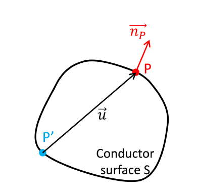

# Installation

Install by using
'''pip install APTrajectories'''

For usage, see the [example Notebook](example.ipynb) notebook

# $Robin-Rolland^{[1]}$ type simulations for APT trajectories.

Consider a perfect conductor isolated in space brought to  electric potential $V_{a}$, as shown above.

$V_{p}$ be the electrostatic potential at point P on the surface. Coloumb's law makes it possible to write this potential from the distribution of charges in space 
(on the surface in this case):

$$V_{p} = \frac{1}{4\pi\varepsilon_{o}}\iint_{S^\prime}\frac{\sigma(P^\prime)}{|\vec{u}|}\,dS^\prime$$
$$ \vec{u} = \vec{P^{\prime}P}$$

When the point P is displaced infinitesimally displace along the unit surface normal $\vec{n_{P}}$, the variation in the potential $V_{P}$ is given by
$$\frac{\partial{V_{P}}}{\partial{n_{P}}} = \frac{1}{4\pi\varepsilon_{o}}\iint_{S^\prime}\frac{\partial(1/|\vec{u}|)}{\partial{n_{P}}}\sigma(P^{\prime})\,dS^\prime$$

$$\frac{\partial{1/|\vec{u}|}}{\partial{n_{P}}} = -\frac{1}{|\vec{u}|^2}\frac{\partial{|\vec{u}|}}{\partial{n_{P}}} = -\frac{\cos(\theta)}{|\vec{u}|^2} = -\frac{\vec{n_{P}}\cdot\vec{u}}{|\vec{u}|^3}$$

where, $\theta$ is the angle between vectors $\vec{n_{P}}$ and $\vec{u}$. Then:

$$\frac{\partial{V_{P}}}{\partial{n_{P}}} = -\frac{1}{4\pi\varepsilon_{o}}\iint_{S^\prime}\frac{\vec{n_{P}}\cdot\vec{u}}{|\vec{u}|^3}\sigma(P^{\prime})\,dS^\prime$$

The surface electric field at point P is given by definition:

$$\vec{F_{P}} = -\vec{\nabla}({V_{p}}) = -\frac{\partial{V_{P}}}{\partial{n_{P}}}\vec{n_{P}}$$

The theory of electrostatics directly relates this field for the conductors to their charge surface density.

$$|\vec{F_{P}}| = \frac{\sigma({P^\prime})}{2 \varepsilon_{o}}$$

Combining the above two equations gives:
$$\sigma(P) = \frac{1}{2\pi} \iint_{S^\prime}\frac{\vec{n_{P}}\cdot\vec{u}}{|\vec{u}|^3}\sigma(P^{\prime})\,dS^\prime     - (1)$$ 

The above integral equation called Robin's equation, connects the surface density of charges at a point on the surface to the distribution of the charge density on the rest of the surface of the conductor. It is possible to solve iteratively by introducing a series of functions $f_{n}$ defined by:

$$f_{n+1}(P) =  \frac{1}{2\pi} \iint_{S^\prime}\frac{\vec{n_{P}}\cdot\vec{u}}{|\vec{u}|^3}f_{n}(P^{\prime})\,dS^\prime$$

with $f_{o}$ as any function defined on a convex surface, Robin showed that this would converge to equation (1).

We consider surface as a series of fractional point charges ${q_{i}}_{i=1,2,...,N}$ placed on each surface atom over a small surface $s_{at}$ .

The electrostatic equilibrium of the conductor can then be described by a local Robin equation as given in equation (1):

$$\frac{q_{i}}{s_{at}} = \frac{1}{2\pi} \sum_{k=1,k\neq i}^{N} q_{k}\frac{\vec{n_i}\cdot\vec{r_{i,k}}}{|\vec{r_{i,k}}|^3}$$

For a point M infinitesimally close to point i, but inside the conductor. The field generated is given by the right-hand side of the above equation pointing outward, whereas the field induced by the atom i points inward, thereby canceling each other out.

Now a sequence of charges is introdued $q_{i,n}$ on atom i, as follows:
$$\frac{q_{i,n+1}}{s_{at}} = \frac{1}{2\pi} \sum_{k=1,k\neq i}^{N} q_{k,n}\frac{\vec{n_i}\cdot\vec{r_{i,k}}}{|\vec{r_{i,k}}|^3}$$

where $q_{i,0}$ being an arbitary real positive number.
the unit vector for $i^{th}$ atom depends on the theoretical P nearest neighbors:

$$\vec{n_{i}} = -\frac{\sum_{j=1}^{P}\delta _{j} \vec{r_{ji}}}{|\sum_{j=1}^{P}\delta _{j} \vec{r_{ji}}|}$$

**Reference**

[1] Rolland, N., Vurpillot, F., Duguay, S., & Blavette, D. (2015). A Meshless Algorithm to Model Field Evaporation in Atom Probe Tomography. Microscopy and Microanalysis, 21(6). https://doi.org/10.1017/S1431927615015184
